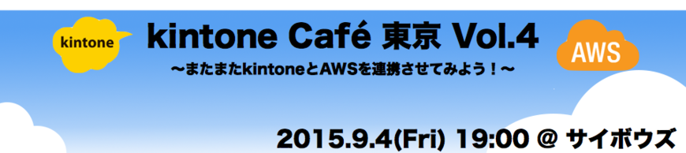
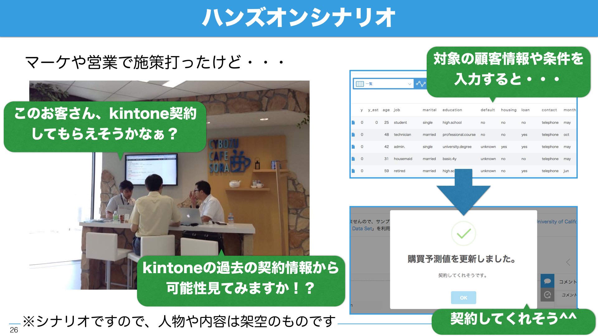
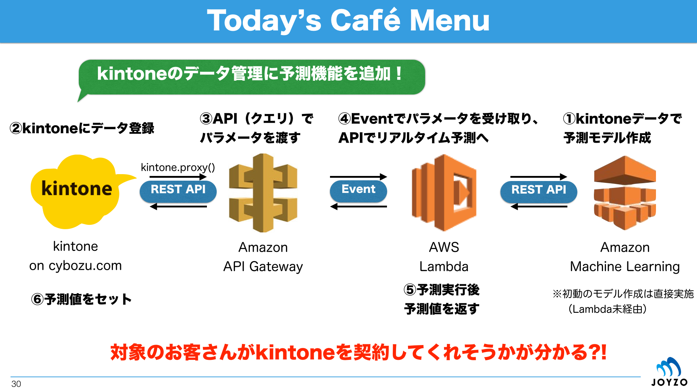

## Contents
* **kintone-Cafe-Tokyo-4-pack.zip**：「kintone契約情報管理」アプリのテンプレートです。実際には、kintoneの契約情報は公開されていませんので、サンプルデータはAmazon Machine Learning [チュートリアル](http://docs.aws.amazon.com/machine-learning/latest/dg/tutorial.html)に登場する「University of California at Irvine Machine Learning Repository」の「Bank Marketing Data Set」を利用します（アプリの構成もこれに準じています）。

* **./data/**：機械学習に使うサンプルファイル群です。

* **./data/kintone.csv**：「kintone契約情報」アプリからダウンロードした機械学習のモデルを作るためのkintoneの契約情報のサンプルファイルです。顧客情報やその他の属性・条件を含みます。最終的に契約したか否かの結果も含まれます。

* **./data/kintone-batch.csv**：バッチ予測に用いるkintoneの契約情報のサンプルファイルです。顧客情報やその他の属性・条件までの内容です。

* **./json**：AWSの設定に用いるファイル群です。

* **./json/sample_event.json**：Lambdaのテスト用eventに使うJSONファイルです。

* **./json/mapping_template.json**：API GatewayのMapping Templateに使うJSONファイルです。

* **./nodejs/**：Node.jsによるLamda関数のサンプルのファイル群です。

* **./nodejs/index.js**：API Gateway経由からの情報をもとにリアルタイム予測をキックして、予測値を返すサンプルです。

* **./clientjs/**：kintoneのJavaScriptカスタマイズ用のファイル群です。

* **./clientjs/51-us-default.css**：kintone新デザイン用のCSSファイルです。

* **./clientjs/kintone-subscription.js**：`kintone.proxy()`からAPI Gatewayで作成したAPI（GETメソッド）をコールするサンプルです。kintoneレコードに登録された情報をクエリに入れてリクエストした後に、リアルタイム予測値を受け取り、レコードにセットします。

## Reference
* [またまたkintoneとAWSを
連携してみよう！](http://www.slideshare.net/yamaryu0508b/kintone-caf-vol3-kintone-aws-lambdas3-50828655)（slideshare）
* [Amazon Web Services](http://aws.amazon.com/jp/)
* [kintone](https://kintone.cybozu.com/jp/)
* [kintone API リファレンス](https://cybozudev.zendesk.com/hc/ja/categories/200147600)（cybozu.com developer network内）
* [kintone JavaScript APIサンプル](https://cybozudev.zendesk.com/hc/ja/sections/200263970)（cybozu.com developer network内）
* [AWS利用無料枠](http://aws.amazon.com/jp/free/)（[FAQ](http://aws.amazon.com/jp/free/faqs/)）
* [kintone30日間無料お試し](https://kintone.cybozu.com/jp/trial/)
* [kintone無償開発者ライセンス](https://cybozudev.zendesk.com/hc/ja/articles/200720464)
